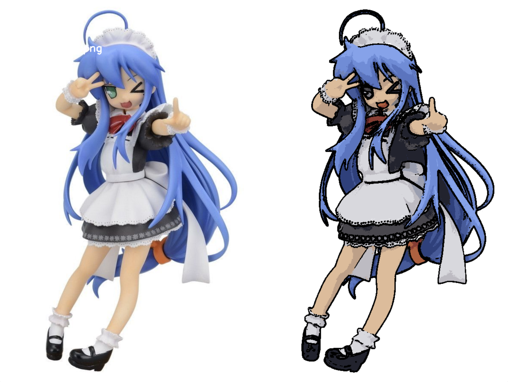
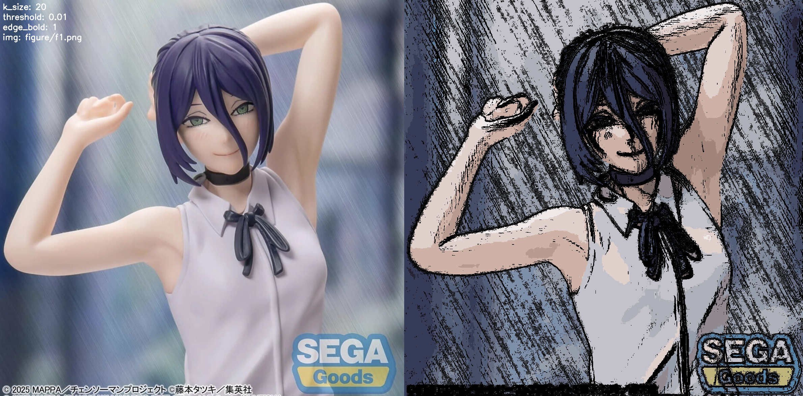

# 피규어 카툰 렌더링 알고리즘

## 개요
실사 피규어 이미지를 애니메이션 셀 채색 스타일로 변환하는 알고리즘입니다.

---

## 알고리즘 구성

### 1. 색상 양자화 (Color Quantization)
K-means 클러스터링을 이용해 이미지의 색상을 k개의 대표 색상으로 단순화합니다.

### 2. 엣지 검출 (Edge Detection)
Sobel 필터를 이용해 픽셀의 밝기 변화량(gradient)을 계산하고, 임계값 이상인 픽셀을 엣지로 판별합니다.

### 3. 엣지 합성
dilate로 엣지를 확장한 뒤 양자화된 색상 이미지에 덮어씌웁니다.

## 인터랙티브 파라미터

| 키 | 동작 |
|----|------|
| `1` | k_size 증가 (색상 단계 늘림) |
| `2` | k_size 감소 (색상 단계 줄임) |
| `w` | threshold 증가 → 엣지 적어짐 |
| `s` | threshold 감소 → 엣지 많아짐 |
| `+` | 엣지 두께 증가 |
| `-` | 엣지 두께 감소 (음수면 흰색 엣지) |
| `a` | 이전 이미지 |
| `d` | 다음 이미지 |
| `ESC` | 종료 |

---

## 결과물 분석

### 잘 된 경우

- 배경이 흰색으로 단순한 이미지
- 색상 영역이 명확히 구분되는 피규어
- 외곽선이 캐릭터 윤곽을 잘 따라감

### 한계가 드러난 경우

- 배경에 대각선 무늬, 흐림 등 복잡한 텍스처가 있는 경우
- 배경과 피사체를 구분하지 못하는 경우

---

## 알고리즘 한계

### 1. 배경 분리 불가
배경이 단순하지 않으면 배경의 텍스처까지 엣지로 검출됩니다.

### 2. K-means의 랜덤성
K-means는 초기값이 랜덤이라 실행할 때마다 색상 결과가 조금씩 달라집니다. 같은 파라미터여도 재실행 시 다른 결과가 나올 수 있습니다.

### 3. 연산 속도
K-means는 픽셀 수 × k만큼의 연산이 필요해서 고해상도 이미지에서 매우 느립니다. 파라미터를 바꿀 때마다 전체 양자화를 다시 실행해야 합니다.

### 4. 복잡한 부분의 처리
얼굴이나 문신같은 작은 부위에 오밀한 색변화가 뭉쳐있는 경우, 결과물이 지저분하게 나옵니다
